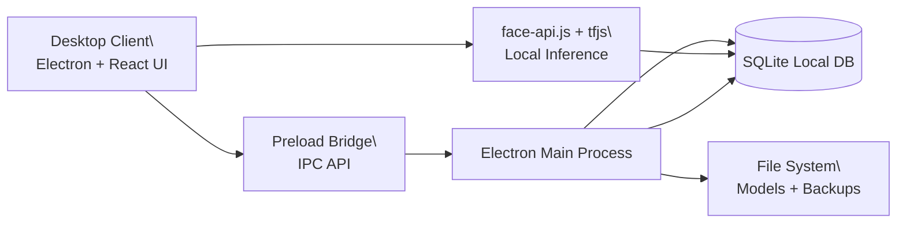
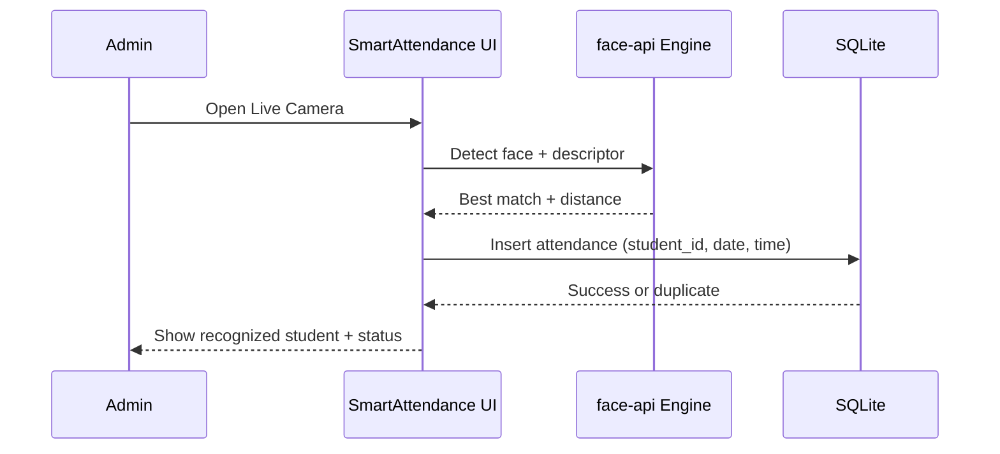
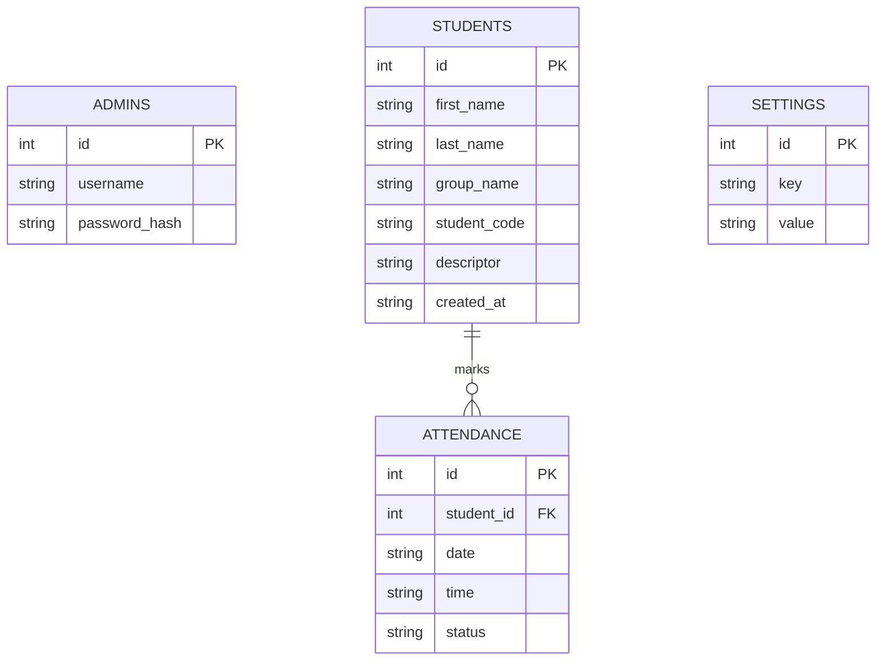

# FACE-ID-SYSTEM-EXE

SmartAttendance is a premium offline-first desktop attendance platform for schools, universities, and learning centers.  
It uses local AI face recognition on Windows with Electron + React + SQLite, and does not require internet during daily operation.

## Why this system

- Fully offline attendance workflow for local networks and low-connectivity environments
- Secure local data processing (no cloud dependency for recognition)
- Fast one-click startup and one-click Windows installer
- Professional dashboard, reports, and admin controls for real institutions

## Core capabilities

- Admin login with hashed password (`bcrypt`)
- Student management (add, edit, delete)
- Face descriptor extraction and secure local storage
- Real-time attendance recognition via local webcam
- Duplicate prevention (same student cannot be marked twice in one day)
- Dashboard with live counters: Total / Present / Absent / Late
- Reports with date/group filters + CSV/Excel/PDF export
- Settings for camera, threshold, backup/restore, and full factory reset

## System Architecture



## Attendance Flow



## Data Model



## Technology Stack

- Frontend: React, React Router, modern CSS
- Desktop shell: Electron
- Database: SQLite (`sqlite3`)
- AI/vision: `@vladmandic/face-api` + TensorFlow.js
- Packaging: `electron-builder` (NSIS installer)

## One-click startup (development/local use)

1. Double-click `start.bat`
2. Script automatically:
   - installs dependencies if needed
   - prepares local face model files
   - initializes database
   - launches desktop app

Default admin account:
- Username: `admin`
- Password: `admin123`

## One-click installer build

1. Double-click `build.bat`
2. Output installer:
   - `release/SmartAttendance-Setup-1.0.0.exe`

## Production deployment notes

- Designed for Windows first (x64)
- Runs locally without internet after setup
- Database is created per machine under app data
- If SmartScreen warning appears, use `More info -> Run anyway` (unsigned installer)

## Security practices implemented

- Password hashing with `bcrypt`
- Input validation in Electron IPC layer
- Duplicate attendance prevention via DB unique rule
- Local-only descriptor storage (no raw public face images)
- Backup/restore and factory reset controls for administrators

## Project structure

```text
src/
  components/
  pages/
  services/
  database/
electron/
models/
public/
scripts/
start.bat
build.bat
reset.bat
```

## Product vision

SmartAttendance is built to be institution-ready: reliable in offline environments, secure by default, and simple enough for daily operator usage while still offering enterprise-style control for administrators.
